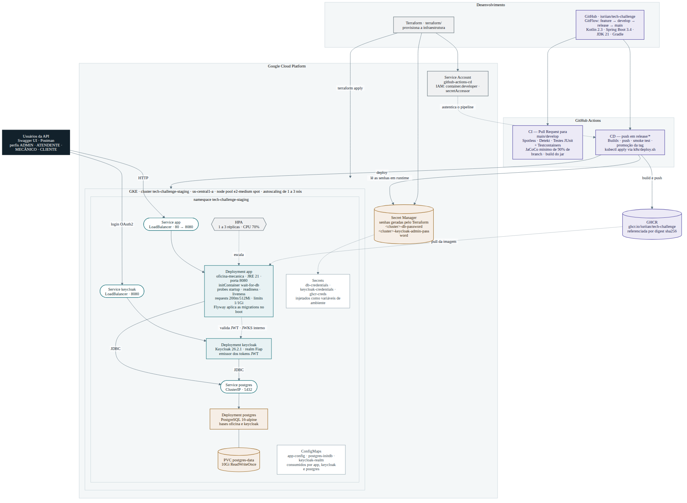
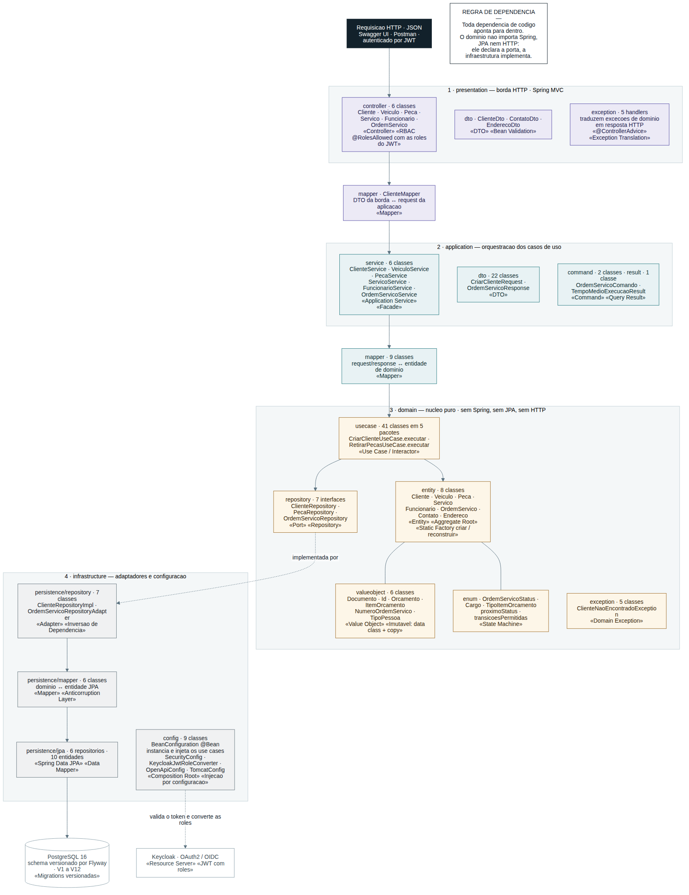
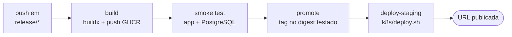

# Tech-Challenge — Sistema Integrado de Atendimento e Execução de Serviços

Sistema de gestão de uma **oficina mecânica**: do cadastro do cliente e do veículo até
a entrega do serviço executado, passando por diagnóstico, orçamento, aprovação e
controle de estoque de peças. API REST em Kotlin/Spring Boot, autenticação e perfis no
Keycloak, PostgreSQL, empacotada em container e entregue em um cluster Kubernetes no
GKE por pipelines de CI/CD.

Trabalho acadêmico da **Pós-Graduação em Software Architecture — FIAP PosTech**, Grupo 89.

| | |
|---|---|
| 📄 **Documento da entrega** | **[docs/solucao-e-arquitetura.md](docs/solucao-e-arquitetura.md)** — solução, objetivos, arquitetura e instruções completas |
| 📮 **Collection das APIs** | [Postman](docs/TechChallengeAPI%20.postman_collection.json) · Swagger UI em `/swagger-ui/index.html` · OpenAPI em `/v3/api-docs` |
| 🎥 **Vídeo demonstrativo** | *(preencher com o link do YouTube/Vimeo, até 15 min)* |
| 🌐 **Ambiente de staging** | *(preencher com a URL publicada pelo pipeline)* |

---

## Descrição da solução e objetivos desta fase

O núcleo do domínio é a **Ordem de Serviço**, governada por uma máquina de estados no
próprio domínio — não é possível pular etapas nem alterar uma ordem já entregue:

```
RECEBIDA → EM_DIAGNOSTICO → AGUARDANDO_APROVACAO → EM_EXECUCAO → FINALIZADA → ENTREGUE
                                     ↓
                                CANCELADA
```

Em volta dela: clientes, veículos, funcionários, catálogo de serviços e estoque de
peças, com acesso controlado por perfil (`ADMIN`, `ATENDENTE`, `MECANICO`, `CLIENTE`).

**Objetivos desta fase.** Nas anteriores a entrega era a aplicação e seu domínio.
Aqui o objeto de avaliação é *como essa aplicação chega e se mantém no ar*:

1. Containerizar a aplicação em uma imagem enxuta e reproduzível, publicada em registry.
2. Orquestrar em Kubernetes com probes, limites de recurso, storage persistente,
   configuração e segredos fora da imagem, e escalonamento horizontal automático.
3. Provisionar a infraestrutura como código com Terraform.
4. Automatizar a verificação (CI): formatação, análise estática, testes e cobertura mínima.
5. Automatizar a entrega (CD): build, teste de fumaça da imagem, promoção e deploy.
6. Manter o ambiente reproduzível localmente com os mesmos manifests do GKE.

Detalhamento em [docs/solucao-e-arquitetura.md](docs/solucao-e-arquitetura.md#1-descrição-da-solução).

---

## Arquitetura

### Visão geral — componentes, infraestrutura e entrega

[](docs/arquitetura.svg)

### Componentes da aplicação

| Componente | Tecnologia | Exposição | Função |
|---|---|---|---|
| **app** | imagem própria · JRE 21 · Spring Boot 3.4 | Service `LoadBalancer` 80 → 8080 | API REST. Aplica as migrations do Flyway no boot |
| **keycloak** | Keycloak 26.2.1 | Service `LoadBalancer` 8080 | Emissor dos tokens JWT, realm `Fiap` |
| **postgres** | PostgreSQL 16-alpine | Service `ClusterIP` 5432 | Bases `oficina` e `keycloak`, com PVC de 10Gi |

Internamente a aplicação segue **Onion Architecture** — o domínio não conhece Spring,
JPA nem HTTP:

[](docs/arquitetura-codigo.svg)

### Infraestrutura provisionada

| Provisionado por Terraform | Aplicado pelo pipeline |
|---|---|
| Cluster GKE `tech-challenge-staging` (zonal, `us-central1-a`) | Deployments de `app`, `keycloak` e `postgres` |
| Node pool `e2-medium` spot, autoscaling de 1 a 3 nós | Services, PVC de 10Gi e HPA de 1 a 3 réplicas |
| Secret Manager com as senhas do banco e do Keycloak | ConfigMaps e Secrets do namespace |
| Service account `github-actions-cd` e papéis IAM | Namespace e ordem de aplicação (`k8s/deploy.sh`) |

### Fluxo de deploy



A imagem é referenciada por **digest** desde o primeiro passo e a tag legível só é
aplicada depois do smoke test: o que foi testado é exatamente o que sobe no cluster.

---

## Execução local

**Pré-requisitos:** Docker e Docker Compose, JDK 21. O Gradle vem no wrapper.

```bash
cp .env.example .env          # ou ./create-env.sh
```

**Infraestrutura em container, aplicação na IDE** *(recomendado para desenvolver)*

```bash
docker compose up -d db keycloak
./gradlew bootRun             # Windows: gradlew.bat bootRun
```

**Stack completa em containers**

```bash
docker compose --profile full up -d
docker compose logs -f app
docker compose down
```

**Kubernetes local com kind** *(valida os mesmos manifests do GKE)*

```bash
./kind/deploy-local.sh        # cria o cluster, builda a imagem e faz o deploy
./kind/down.sh                # destrói o cluster
```

| Serviço | URL | Credenciais |
|---|---|---|
| Aplicação (`bootRun`) | <http://localhost:8080> | — |
| Aplicação (perfil `full`) | <http://localhost:8090> | — |
| Swagger UI | `<url-da-app>/swagger-ui/index.html` | via Keycloak |
| Keycloak | <http://localhost:8081> | `admin` / `admin` |
| PostgreSQL | `localhost:5432` | `user` / `password` |

**Usuários do realm `Fiap`:** `admin`/`admin` (ADMIN), `atendente`/`atendente`
(ATENDENTE), `mecanico`/`mecanico` (MECANICO), `clientepadrao`/`clientepadrao` (CLIENTE).
No Swagger, clique em **Authorize**, informe o client `oficina` e faça login.

**Testes**

```bash
./gradlew test                  # integração exige Docker rodando
./gradlew jacocoTestReport      # build/reports/jacoco/test/html/index.html
```

Passo a passo completo, incluindo o Nginx e o arquivo `hosts`:
[docs/solucao-e-arquitetura.md](docs/solucao-e-arquitetura.md#41-execução-local).

---

## Deploy em Kubernetes

**Pelo pipeline** — um push em `release/*` dispara build, smoke test, promoção e deploy:

```bash
git checkout -b release/1.1.0
git push -u origin release/1.1.0
```

**Manualmente**, com `kubectl` autenticado no cluster:

```bash
gcloud container clusters get-credentials tech-challenge-staging \
  --zone us-central1-a --project SEU_PROJECT_ID

kubectl create namespace tech-challenge-staging
# crie os secrets db-credentials, keycloak-credentials e ghcr-creds

./k8s/deploy.sh ghcr.io/iuriian/tech-challenge@sha256:DIGEST staging tech-challenge-staging
```

**Verificação e rollback**

```bash
kubectl get pods,svc,pvc,hpa -n tech-challenge-staging
kubectl rollout undo deployment/app -n tech-challenge-staging
```

Secrets, ordem de aplicação e diagnóstico de falhas:
[docs/solucao-e-arquitetura.md](docs/solucao-e-arquitetura.md#42-deploy-em-kubernetes)
· [docs/cd.md](docs/cd.md) · [k8s/README.md](k8s/README.md).

---

## Provisionamento da infraestrutura com Terraform

```bash
gcloud auth application-default login

cd terraform
cp terraform.tfvars.example terraform.tfvars   # ajuste project_id
terraform init
terraform apply                                # 5 a 10 minutos

terraform output github_environment_variables  # valores para o Environment do GitHub
eval "$(terraform output -raw get_credentials_command)"
kubectl get nodes
```

Configure em Settings → Environments → `staging`: os secrets `GCP_SA_KEY` e
`GHCR_PAT`, e as variables `GCP_PROJECT_ID`, `GKE_CLUSTER` e `GKE_ZONE`.

Para destruir o ambiente: `terraform destroy`. **Nunca versione o `.tfstate`** — ele
grava valores sensíveis em texto puro.

Detalhes: [docs/solucao-e-arquitetura.md](docs/solucao-e-arquitetura.md#43-provisionamento-da-infraestrutura-com-terraform)
· [terraform/README.md](terraform/README.md).

---

## Tecnologias

| Camada | Stack |
|---|---|
| Backend | Kotlin 2.3 · Java 21 · Spring Boot 3.4 · Spring MVC · Spring Data JPA · Spring Security |
| Banco | PostgreSQL 16 · Flyway (12 migrations) |
| Autenticação | Keycloak 26.2.1 · OAuth2 / OIDC · JWT |
| Documentação | SpringDoc OpenAPI 2.8.5 · Swagger UI |
| Qualidade | JUnit 5 · Testcontainers · JaCoCo · Detekt · Spotless/ktlint · SonarQube |
| Build | Gradle (Kotlin DSL) |
| Container | Docker multi-stage · Docker Compose · GHCR |
| Orquestração | Kubernetes · GKE · kind (local) |
| Infraestrutura | Terraform · Google Cloud Platform |
| CI/CD | GitHub Actions |

---

## Documentação

| Documento | Conteúdo |
|---|---|
| [docs/solucao-e-arquitetura.md](docs/solucao-e-arquitetura.md) | Documento da entrega: solução, objetivos, arquitetura e instruções |
| [docs/versionamento.md](docs/versionamento.md) | GitFlow, convenções de commit, SemVer e versionamento da imagem |
| [docs/ci.md](docs/ci.md) | Pipeline de integração contínua |
| [docs/cd.md](docs/cd.md) | Pipeline de entrega, rollback e troubleshooting |
| [docs/adr-001.md](docs/adr-001.md) | Decisão arquitetural: PostgreSQL e Flyway |
| [docs/linguagem-ubiqua.md](docs/linguagem-ubiqua.md) | Glossário do domínio |
| [docs/relatorio-vulnerabilidades.md](docs/relatorio-vulnerabilidades.md) | Vulnerabilidades das dependências |
| [k8s/README.md](k8s/README.md) · [kind/README.md](kind/README.md) · [terraform/README.md](terraform/README.md) | Manifests, ambiente local e infraestrutura |

---

## 👥 Autores

Desenvolvido por alunos da **FIAP PosTech** - Software Architecture - Grupo 89

| Aluno         | Matricula | Email                           | Github                          |
|---------------|-----------|---------------------------------|---------------------------------|
| Alan Alves    | 	RM370177 | 	dev.alan87@gmail.com	          | 	https://github.com/dev-alan87  |
| Caio Colares  | 	RM375500 | 	colares.caio@gmail.com	        | https://github.com/caiocolares  |
| Eliézer Lucas | 	RM374476 | 	eliezerlucaslg@gmail.com	      | 	https://github.com/eliezerluca |
| Nicolas       | 	RM37488  | nicolasmoraes1906@yahoo.com.br	 | 	https://github.com/Nisk-Moraes |
| Iuri Ian      | 	RM375031 | 	iuriian15@gmail.com	           | 	https://github.com/iuriian     |

---
