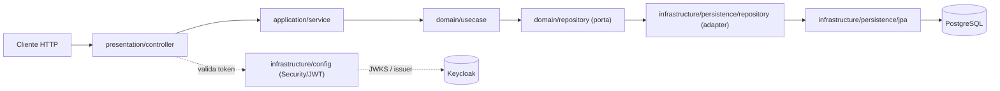

# Tech Challenge — Fase 2
### Sistema Integrado de Atendimento e Execução de Serviços (Oficina Mecânica)

Trabalho acadêmico da Pós-Graduação em **Software Architecture** — FIAP PosTech.

---

## 📚 Sumário

- [Sobre o projeto](#-sobre-o-projeto)
- [Objetivo desta fase](#-objetivo-desta-fase)
- [Tecnologias utilizadas](#️-tecnologias-utilizadas)
- [Arquitetura da aplicação](#-arquitetura-da-aplicação)
- [Infraestrutura provisionada](#️-infraestrutura-provisionada)
- [Fluxo de CI/CD e deploy](#-fluxo-de-cicd-e-deploy)
- [Executando localmente](#-executando-localmente)
- [Deploy em Kubernetes](#️-deploy-em-kubernetes)
- [Provisionamento com Terraform](#-provisionamento-da-infraestrutura-com-terraform)
- [Documentação da API](#-documentação-da-api)
- [Testes e qualidade](#-testes-e-qualidade)
- [Estrutura do repositório](#-estrutura-do-repositório)
- [Documentação complementar](#-documentação-complementar)
- [Autores](#-autores)

---

## 📖 Sobre o projeto

O sistema apoia a operação de uma **oficina mecânica**, cobrindo o ciclo de atendimento de
ponta a ponta:

- **Clientes** — pessoas físicas ou jurídicas (CPF/CNPJ), com endereço e contatos.
- **Veículos** — vinculados a um cliente (motorista/proprietário), identificados pela placa.
- **Peças** — itens de reposição com controle de estoque (entrada/saída, ativação/desativação).
- **Funcionários** — perfis de atendimento e execução (Atendente, Mecânico).
- **Serviços (Ordens de Serviço)** — abertos para um cliente/veículo, acompanhados por um
  ciclo de status (`RECEBIDA` → `EM_DIAGNOSTICO` → `AGUARDANDO_APROVACAO` → `EM_EXECUCAO` →
  `FINALIZADA` → `ENTREGUE`), consumindo peças do estoque.

O acesso à API é controlado por autenticação/autorização via **Keycloak** (OAuth2/JWT), com
quatro perfis: `ADMIN`, `ATENDENTE`, `MECANICO` e `CLIENTE`.

> O vocabulário completo do domínio (entidades, atributos, status, papéis) está detalhado em
> [`docs/linguagem-ubiqua.md`](docs/linguagem-ubiqua.md).

## 🎯 Objetivo desta fase

Na Fase 1 o foco foi a modelagem do domínio e a API REST (Kotlin/Spring Boot, arquitetura
hexagonal, PostgreSQL, Keycloak). **Nesta fase (Fase 2)** o objetivo é levar essa aplicação para
produção de forma automatizada, cobrindo:

- **Containerização** da aplicação com Docker (build multi-stage, imagem enxuta).
- **Orquestração com Kubernetes** — manifests próprios (`k8s/`) para aplicação, PostgreSQL e
  Keycloak, com HPA, probes e um cluster local reproduzível via `kind/` para validar tudo antes
  de gastar recursos em nuvem.
- **Infraestrutura como código com Terraform** (`terraform/`) — provisionamento do cluster
  Kubernetes gerenciado (GKE) e dos recursos de IAM/segredos que sustentam esses workloads.
- **Pipeline de CI/CD** (`.github/workflows/`) — CI que roda em todo Pull Request (lint,
  testes, cobertura, build) e CD que builda a imagem, valida com smoke test, promove a tag e
  faz o deploy automático em staging a cada push em `release/**`.
- **Postura de segurança** documentada (ver [`docs/relatorio-vulnerabilidades.md`](docs/relatorio-vulnerabilidades.md)):
  execução da aplicação com usuário sem privilégios no container, segredos gerados e
  armazenados fora do controle de versão (Secret Manager), e análise estática (SonarQube).

## 🛠️ Tecnologias utilizadas

| Categoria | Tecnologias |
|---|---|
| Linguagem / Runtime | Kotlin 2.3.x, Java 21 (LTS) |
| Framework | Spring Boot 3.4.0 (Web, Data JPA, Validation, Security, OAuth2 Resource Server, Actuator) |
| Banco de dados | PostgreSQL 16, Flyway (migrations) |
| Autenticação | Keycloak 26.2.1 (OAuth2/JWT) |
| Documentação de API | SpringDoc OpenAPI / Swagger UI |
| Containers | Docker, Docker Compose |
| Orquestração | Kubernetes (manifests em `k8s/`), kind (cluster local) |
| Infraestrutura como código | Terraform (provider `google`, GKE) |
| CI/CD | GitHub Actions |
| Qualidade | Detekt, Spotless, JaCoCo, SonarQube |
| Build | Gradle (Kotlin DSL) |

---

## 🏗️ Arquitetura da aplicação

A aplicação segue **arquitetura hexagonal** (Ports & Adapters / Onion), separando regras de
negócio dos detalhes de infraestrutura. O pacote raiz é `br.com.fiap.oficina`:

```
src/main/kotlin/br/com/fiap/oficina/
├── domain/                    # Núcleo — regras de negócio, sem dependência de framework
│   ├── entity/                 # Entidades de domínio (Cliente, Veiculo, Peca, Servico...)
│   ├── enum/                   # Enums de domínio (ex.: ServicoStatus)
│   ├── valueobject/             # Objetos de valor (ex.: Documento, TipoPessoa)
│   ├── repository/              # Portas (interfaces) de persistência, definidas pelo domínio
│   ├── usecase/                 # Casos de uso por agregado (cliente, veiculo, peca, funcionario)
│   └── exception/               # Exceções de domínio
│
├── application/               # Orquestração dos casos de uso
│   ├── service/                 # Implementações que orquestram usecases/repositórios
│   ├── mapper/                  # Conversão entre entidades de domínio e DTOs
│   └── dto/                     # DTOs de aplicação
│
├── infrastructure/             # Adaptadores de saída (driven adapters)
│   ├── persistence/
│   │   ├── jpa/entity/           # Entidades JPA (mapeamento com o banco)
│   │   ├── jpa/repository/       # Spring Data JPA Repositories
│   │   ├── mapper/               # Conversão entre entidade JPA ↔ entidade de domínio
│   │   └── repository/           # Implementação das portas de repositório do domínio
│   └── config/                  # Configuração de segurança (Keycloak/JWT), beans, etc.
│
└── presentation/               # Adaptadores de entrada (driving adapters)
    ├── controller/               # Controllers REST
    ├── dto/                      # Request/Response da API
    ├── mapper/                   # Conversão entre DTOs de presentation e domínio/aplicação
    └── exception/                # Handlers globais de exceção (@ControllerAdvice)
```

Fluxo de uma requisição:



Princípio central: o `domain` não depende de Spring, JPA ou qualquer framework — apenas
`application` e `infrastructure`/`presentation` conhecem detalhes técnicos, o que mantém as
regras de negócio isoladas e testáveis (a cobertura de testes do domínio é o motivo do gate de
90% de branch coverage no CI).

Versionamento de schema é feito por **Flyway** (`src/main/resources/db/migration/V1__...` a
`V9__...`), aplicado automaticamente no startup da aplicação — decisão registrada em
[`docs/adr-001.md`](docs/adr-001.md).

---

## ☁️ Infraestrutura provisionada

A infraestrutura é dividida em duas responsabilidades, com fronteira explícita entre elas
(ver [`terraform/README.md`](terraform/README.md)):

| Camada | Ferramenta | O que provisiona |
|---|---|---|
| **Cluster** (muda raramente) | Terraform | Cluster GKE, node pool, APIs do GCP, service account de CI, segredos gerados |
| **Workloads** (mudam a cada commit) | Kubernetes (`k8s/`) + `deploy.sh` | Deployments/Services/ConfigMaps da aplicação, Postgres e Keycloak |

### Terraform (`terraform/`)

Provisiona a infraestrutura de **staging** no Google Cloud:

- `google_container_cluster` — cluster GKE zonal (`tech-challenge-staging`, deletion
  protection desligada por ser staging descartável).
- `google_container_node_pool` — node pool com autoscaling (1 a 3 nós `e2-medium`, Spot VMs
  por padrão), dimensionado para caber os requests da stack (~500m CPU / 1,25Gi memória).
- APIs do GCP habilitadas automaticamente (`container`, `compute`, `logging`, `monitoring`,
  `iam`, `secretmanager`).
- `google_service_account` — service account usada pelo GitHub Actions no deploy, com o papel
  mínimo `roles/container.developer`.
- `random_password` + `google_secret_manager_secret` — senhas do PostgreSQL e do admin do
  Keycloak geradas pelo Terraform e guardadas no Secret Manager (nunca digitadas manualmente
  ou salvas como secret do GitHub).

### Kubernetes (`k8s/`)

Workloads aplicados no namespace `tech-challenge-staging` (ou outro, via parâmetro):

| Componente | Manifests | Detalhes |
|---|---|---|
| **App** | `k8s/app/deployment.yaml`, `k8s/app/configmap.yaml`, `k8s/app/hpa.yaml` | Deployment (réplicas controladas pelo HPA, 1–3), Service `LoadBalancer`, init container que espera o Postgres, probes de `/actuator/health`, `securityContext` sem privilégios |
| **PostgreSQL** | `k8s/postgres/deployment.yaml`, `k8s/postgres/pvc.yaml` | Deployment único + PVC de 10Gi, `Service` `ClusterIP`, dados de init via ConfigMap gerada a partir de `conf/init-db/` |
| **Keycloak** | `k8s/keycloak/deployment.yaml`, `k8s/keycloak/service.yaml` | Deployment com import do realm `Fiap` (a partir de `conf/realm-export.json`), `Service` `LoadBalancer` (aplicado **antes** do Deployment para descobrir o IP público usado como issuer) |

Os ConfigMaps `postgres-initdb` e `keycloak-realm` **não são versionados** dentro de `k8s/`:
o `k8s/deploy.sh` os gera dinamicamente a partir dos mesmos arquivos usados pelo
`docker-compose.yml` (`conf/init-db/` e `conf/realm-export.json`), evitando duplicação.

### Ambiente local com `kind/`

Para validar os manifests de `k8s/` sem custo de nuvem, `kind/` sobe um cluster Kubernetes real
dentro do Docker, **reaproveitando os mesmos manifests** e apenas trocando os `Service`
`LoadBalancer` por `NodePort` (kind não tem cloud controller).

---

## 🔁 Fluxo de CI/CD e deploy

### CI (`.github/workflows/ci.yml`) — a cada Pull Request para `main`/`develop`

```
Static Code Analysis (Spotless + Detekt) → Unit Test → Coverage (≥ 90% branch) → Build
```

- **Spotless** e **Detekt** — formatação e análise estática (não bloqueiam o PR por padrão,
  mas reportam).
- **Unit Test** — `./gradlew test`.
- **Coverage** — gate de cobertura mínima de 90% (métrica `BRANCH`) via JaCoCo.
- **Build** — `./gradlew build`, artefato do jar publicado como artifact do workflow.

### CD Staging (`.github/workflows/cd-staging.yml`) — a cada push em `release/**` (ou manual)

```
build → smoke-test → promote → deploy-staging
```

1. **`build`** — builda a imagem Docker (`docker/build-push-action`) e publica no GHCR
   (`ghcr.io/<repo>`), taggeada pelo SHA curto do commit; a referência usada nos próximos jobs
   é o **digest** da imagem (imutável).
2. **`smoke-test`** — sobe a imagem com um Postgres de teste e valida que a aplicação inicia
   corretamente antes de qualquer promoção.
3. **`promote`** — usa `docker buildx imagetools create` para aplicar tags estáveis
   (`latest` na branch padrão, tag da branch) ao **mesmo digest** já testado — nunca rebuilda.
4. **`deploy-staging`** (`environment: staging`):
   - valida que `GCP_SA_KEY`, `GCP_PROJECT_ID`, `GKE_CLUSTER` e `GKE_ZONE` estão configurados
     no Environment do GitHub;
   - autentica no GCP e obtém credenciais do cluster GKE (`gcloud container clusters
     get-credentials`);
   - cria/garante o namespace;
   - busca `DB_PASSWORD` e `KEYCLOAK_ADMIN_PASSWORD` no **Secret Manager** (gerados pelo
     Terraform) e cria os `Secret`s do Kubernetes em runtime;
   - cria o secret `ghcr-creds` para pull da imagem privada;
   - valida os manifests com `kubectl apply --dry-run=server`;
   - executa `./k8s/deploy.sh "<imagem>" staging <namespace>`, que aplica Postgres → Keycloak
     (aguardando IP externo para configurar o issuer) → aplicação → HPA, em ordem;
   - aguarda o IP externo do `Service` da aplicação e valida `GET /actuator/health`;
   - em caso de falha, roda um passo de diagnóstico completo (pods, eventos, logs).

O build da imagem usa o [`Dockerfile`](Dockerfile) multi-stage: estágio de build com
`eclipse-temurin:21-jdk-jammy` + Gradle Wrapper (`bootJar -x test`, testes ficam a cargo do CI),
e estágio de runtime com `eclipse-temurin:21-jre-jammy`, jar extraído em camadas
(`-Djarmode=tools ... extract --layers`) para melhor cache, executando como usuário `spring`
sem privilégios.

---

## 💻 Executando localmente

### Pré-requisitos

- [Docker](https://www.docker.com/) e Docker Compose
- [JDK 21](https://adoptium.net/) (para rodar fora de container)
- Gradle Wrapper incluso (não é necessário instalar o Gradle)

### Variáveis de ambiente

Copie o exemplo e ajuste se necessário (os valores padrão já funcionam com o
`docker-compose.yml`):

```bash
cp .env.example .env
```

| Variável | Padrão | Uso |
|---|---|---|
| `POSTGRES_DB` | `oficina` | Nome do banco da aplicação |
| `POSTGRES_USER` / `POSTGRES_PASSWORD` | `user` / `password` | Credenciais do PostgreSQL |
| `KEYCLOAK_URL` | `http://localhost:8081` | URL pública do Keycloak (issuer validado pelo Spring Security) |
| `KEYCLOAK_ADMIN_USER` / `KEYCLOAK_ADMIN_PASSWORD` | `admin` / `admin` | Credenciais do admin do Keycloak |
| `KEYCLOAK_REALM` | `Fiap` | Realm importado de `conf/realm-export.json` |
| `KEYCLOAK_CLIENT_ID` | `oficina` | Client usado pelo Swagger UI / clientes da API |

A aplicação também aceita `DB_URL`, `DB_USERNAME`, `DB_PASSWORD` e `KEYCLOAK_JWK_SET_URI`
diretamente (ver `src/main/resources/application.properties`) — usadas nos manifests de
Kubernetes para apontar para os serviços internos do cluster.

### Opção 1 — Docker Compose (infraestrutura completa)

Sobe PostgreSQL, Keycloak, e opcionalmente a aplicação e o Nginx (`profiles: ["full"]`):

```bash
# Apenas infraestrutura (Postgres + Keycloak)
docker-compose up -d

# Infraestrutura + aplicação + Nginx
docker-compose --profile full up -d --build

# Logs
docker-compose logs -f

# Parar
docker-compose down
```

| Serviço | URL | Credenciais |
|---|---|---|
| PostgreSQL | `localhost:5432` | `user` / `password` |
| Keycloak | `http://localhost:8081` | `admin` / `admin` |
| Aplicação (com `--profile full`) | `http://localhost:8090` | — |
| Nginx (com `--profile full`) | `http://localhost:80` | — |

### Opção 2 — Aplicação via Gradle (desenvolvimento)

Suba apenas a infraestrutura e rode a aplicação localmente para iterar mais rápido:

```bash
docker-compose up -d db keycloak

./gradlew bootRun
# Windows: gradlew.bat bootRun
```

A aplicação estará disponível em `http://localhost:8080`.

### Opção 3 — IDE (IntelliJ IDEA)

1. Importe o projeto como projeto Gradle.
2. `docker-compose up -d db keycloak`.
3. Execute a classe principal (`OficinaApplication`).

### Usuários pré-configurados no Keycloak (realm `Fiap`)

| Usuário | Senha | Perfil (Role) |
|---|---|---|
| `admin` | `admin` | ADMIN |
| `atendente` | `atendente` | ATENDENTE |
| `mecanico` | `mecanico` | MECANICO |
| `clientepadrao` | `clientepadrao` | CLIENTE |

---

## ☸️ Deploy em Kubernetes

### Opção A — Cluster local com `kind` (recomendado para testar antes do GKE)

```bash
./kind/deploy-local.sh                     # cria o cluster, builda a imagem local e faz o deploy
SKIP_BUILD=true ./kind/deploy-local.sh     # redeploy reaproveitando a imagem já buildada
APP_HOST_PORT=19000 ./kind/deploy-local.sh # se as portas padrão (18080/18081) estiverem ocupadas
./kind/down.sh                             # destrói o cluster
```

Endereços após o deploy:

| | URL |
|---|---|
| App | `http://localhost:18080` |
| Health | `http://localhost:18080/actuator/health` |
| Swagger UI | `http://localhost:18080/swagger-ui/index.html` |
| Keycloak | `http://localhost:18081` (`admin` / `admin`) |

Requer Docker Desktop, [`kind`](https://kind.sigs.k8s.io/) e `kubectl` — scripts são bash
(no Windows, use Git Bash ou WSL). Detalhes em [`kind/README.md`](kind/README.md).

### Opção B — Cluster GKE (staging)

Pressupõe um cluster já provisionado (veja a seção de [Terraform](#-provisionamento-da-infraestrutura-com-terraform))
e `kubectl` autenticado (`gcloud container clusters get-credentials ...`):

```bash
NS=tech-challenge-staging
kubectl create namespace $NS

# Secrets (deixe o deploy.sh gerar valores padrão apenas em ambiente local)
kubectl create secret generic db-credentials -n $NS \
  --from-literal=POSTGRES_USER=user \
  --from-literal=POSTGRES_PASSWORD='SENHA_FORTE'

kubectl create secret generic keycloak-credentials -n $NS \
  --from-literal=KEYCLOAK_ADMIN_USER=admin \
  --from-literal=KEYCLOAK_ADMIN_PASSWORD='SENHA_FORTE'

# Secret para puxar a imagem do GHCR (repositório privado)
kubectl create secret docker-registry ghcr-creds -n $NS \
  --docker-server=ghcr.io \
  --docker-username=SEU_USUARIO \
  --docker-password=SEU_PAT

./k8s/deploy.sh ghcr.io/seu-usuario/tech-challenge:latest staging $NS
```

O script `k8s/deploy.sh` orquestra toda a ordem de aplicação (secrets → ConfigMaps →
PostgreSQL → Service do Keycloak, aguardando IP externo → Deployment do Keycloak → aplicação →
HPA), necessária porque o *issuer* validado pelo Spring Security precisa ser idêntico à URL
pública pela qual o token foi obtido. Variáveis aceitas: `POSTGRES_USER`, `POSTGRES_PASSWORD`,
`KEYCLOAK_ADMIN_USER`, `KEYCLOAK_ADMIN_PASSWORD`, `KEYCLOAK_IP_TIMEOUT`, `ROLLOUT_TIMEOUT`.

Em produção/CI, esse deploy é disparado automaticamente pelo `cd-staging.yml` (ver
[Fluxo de CI/CD](#-fluxo-de-cicd-e-deploy)) — o passo manual acima serve para deploys ad-hoc ou
depuração. Detalhes completos, troubleshooting e configuração do GitHub Environment `staging`
em [`k8s/README.md`](k8s/README.md).

### Verificação

```bash
NS=tech-challenge-staging
kubectl get pods -n $NS
kubectl get svc -n $NS                # EXTERNAL-IP de app e keycloak
curl http://<APP_IP>/actuator/health  # {"status":"UP"}
```

---

## 🌍 Provisionamento da infraestrutura com Terraform

A pasta `terraform/` está presente no repositório e provisiona **apenas o que sustenta os
workloads de `k8s/`**: o cluster GKE, o node pool e a service account/segredos usados pelo CI.
Os Deployments/Services da aplicação, Postgres e Keycloak continuam em `k8s/`, aplicados pelo
`k8s/deploy.sh` — a fronteira é deliberada (ver [`terraform/README.md`](terraform/README.md)):
o cluster muda raramente, os workloads mudam a cada commit.

### Pré-requisitos

- Conta no Google Cloud com um projeto criado (billing habilitado).
- [Terraform](https://developer.hashicorp.com/terraform) ≥ 1.9.
- [gcloud CLI](https://cloud.google.com/sdk/docs/install) autenticado.

### Uso

```bash
gcloud auth application-default login

cd terraform
cp terraform.tfvars.example terraform.tfvars   # ajuste project_id (obrigatório)
terraform init
terraform plan
terraform apply     # leva de 5 a 10 minutos — criar cluster GKE é lento
```

Ao final:

```bash
terraform output
eval "$(terraform output -raw get_credentials_command)"   # aponta o kubectl para o cluster
kubectl get nodes
```

### Variáveis principais (`terraform/variables.tf`)

| Variável | Padrão | Descrição |
|---|---|---|
| `project_id` | *(obrigatória)* | ID do projeto GCP — deve casar com a variable `GCP_PROJECT_ID` do Environment `staging` no GitHub |
| `region` | `us-central1` | Região padrão dos recursos |
| `zone` | `us-central1-a` | Zona do cluster (zonal, mais barato que regional) |
| `cluster_name` | `tech-challenge-staging` | Nome do cluster — deve casar com `GKE_CLUSTER` |
| `machine_type` | `e2-medium` | Tipo de máquina dos nós (mínimo que comporta a stack; `e2-small` deixa a app em `Pending`) |
| `min_node_count` / `max_node_count` | `1` / `3` | Faixa do cluster autoscaler, alinhada ao HPA da aplicação (`k8s/app/hpa.yaml`) |
| `use_spot_vms` | `true` | Usa Spot VMs (60–91% mais barato; risco aceitável em staging) |
| `disk_size_gb` | `30` | Disco por nó |
| `network` / `subnetwork` | `default` / `default` | VPC/subnet onde o cluster é criado |
| `ci_service_account_id` | `github-actions-cd` | ID da service account usada pelo GitHub Actions |

O que é provisionado: `google_container_cluster` + `google_container_node_pool` (GKE),
habilitação das APIs necessárias (`container`, `compute`, `logging`, `monitoring`, `iam`,
`secretmanager`), a `google_service_account` do CI com papel `roles/container.developer`, e
senhas geradas via `random_password` armazenadas no Secret Manager (`db_password`,
`keycloak_admin_password`) — nunca gravadas como secret do GitHub.

### State remoto (recomendado / requisito prático)

O `versions.tf` já referencia um backend `gcs`. Antes do primeiro `init`, crie o bucket:

```bash
gcloud storage buckets create gs://SEU_PROJECT_ID-tfstate \
  --project SEU_PROJECT_ID --location us-central1
gcloud storage buckets update gs://SEU_PROJECT_ID-tfstate --versioning
terraform init -migrate-state
```

> **Nunca versione o `.tfstate`** — ele grava valores sensíveis (senhas geradas) em texto puro.
> Como `random_password` grava o segredo no state, o backend remoto deixa de ser apenas
> conveniência e passa a ser requisito prático.

### Chave `GCP_SA_KEY` (secret do GitHub Environment `staging`)

Não é criada pelo Terraform de propósito (evita gravar a chave privada no state):

```bash
SA=$(terraform output -raw ci_service_account_email)
gcloud iam service-accounts keys create key.json --iam-account "$SA"
# cole o conteúdo em Settings → Environments → staging → GCP_SA_KEY, depois apague o key.json
```

### Destruindo o ambiente (economia de custo)

```bash
kubectl delete svc app keycloak -n tech-challenge-staging   # remove LoadBalancers antes
terraform destroy
```

Estimativa de custo com os defaults (1 nó `e2-medium` spot): **~US$ 48/mês** se mantido no ar
continuamente — por isso o fluxo recomendado é `destroy` ao terminar e `apply` (~10 min) quando
precisar novamente. Detalhamento completo de dimensionamento, custo, rotação de senhas e IP
fixo do Keycloak em [`terraform/README.md`](terraform/README.md).

---

## 📖 Documentação da API

Com a aplicação em execução, a documentação interativa fica disponível via Swagger UI:

- **Swagger UI:** `http://localhost:8080/swagger-ui/index.html` (ou `:18080` no `kind`, ou o
  IP externo do `Service` no GKE)
- **OpenAPI JSON:** `http://localhost:8080/v3/api-docs`

Para testar endpoints protegidos:

1. Abra o Swagger UI e clique em **Authorize** (cadeado no topo).
2. No campo `client_id`, use `oficina`.
3. Faça login com um dos [usuários pré-configurados](#usuários-pré-configurados-no-keycloak-realm-fiap).

Uma collection do Postman também está disponível em
[`docs/TechChallengeAPI .postman_collection.json`](<docs/TechChallengeAPI .postman_collection.json>).

## ✅ Testes e qualidade

```bash
./gradlew test                    # testes unitários e de integração (Testcontainers + PostgreSQL)
./gradlew test jacocoTestReport   # com relatório de cobertura
./gradlew spotlessCheck           # formatação
./gradlew detekt                  # análise estática
```

O relatório de cobertura é gerado em `build/reports/jacoco/test/html/index.html`. O CI aplica
um gate mínimo de **90% de cobertura de branch**. A análise de segurança mais recente
(SonarQube) está documentada em [`docs/relatorio-vulnerabilidades.md`](docs/relatorio-vulnerabilidades.md) —
sem vulnerabilidades, bugs ou security hotspots identificados.

## 📁 Estrutura do repositório

```
fase2/
├── .github/workflows/       # CI (ci.yml) e CD de staging (cd-staging.yml)
├── conf/                    # Config compartilhada por Docker Compose e Kubernetes
│   ├── init-db/               # Scripts de inicialização do banco (bancos oficina/keycloak)
│   ├── nginx.conf              # Proxy reverso (perfil "full" do docker-compose)
│   └── realm-export.json       # Configuração do realm Keycloak (Fiap)
├── docs/                    # ADRs, linguagem ubíqua, relatório de vulnerabilidades, collection Postman
├── k8s/                     # Manifests Kubernetes (app, postgres, keycloak) + deploy.sh
├── kind/                    # Cluster Kubernetes local (kind) para validar os manifests de k8s/
├── terraform/               # Infraestrutura do cluster GKE de staging (IaC)
├── src/
│   ├── main/kotlin/            # Código-fonte (arquitetura hexagonal — ver seção de arquitetura)
│   ├── main/resources/          # application.properties + migrations Flyway (db/migration)
│   └── test/                    # Testes automatizados
├── build.gradle.kts         # Configuração do Gradle
├── docker-compose.yml       # Orquestração local (Postgres, Keycloak, app, Nginx)
├── Dockerfile               # Build multi-stage da imagem da aplicação
└── README.md
```

## 📎 Documentação complementar

| Documento | Conteúdo |
|---|---|
| [`docs/adr-001.md`](docs/adr-001.md) | Decisão arquitetural: adoção do PostgreSQL |
| [`docs/linguagem-ubiqua.md`](docs/linguagem-ubiqua.md) | Glossário do domínio (entidades, status, papéis) |
| [`docs/relatorio-vulnerabilidades.md`](docs/relatorio-vulnerabilidades.md) | Relatório de análise de segurança (SonarQube) |
| [`docs/eventstorming.drawio`](docs/eventstorming.drawio) | Event Storming do domínio |
| [`k8s/README.md`](k8s/README.md) | Deploy em Kubernetes/GKE em detalhe (troubleshooting, Environment do GitHub) |
| [`kind/README.md`](kind/README.md) | Cluster local com kind em detalhe |
| [`terraform/README.md`](terraform/README.md) | Infraestrutura do cluster em detalhe (custo, dimensionamento, rotação de senhas) |

## 👥 Autores

Desenvolvido por alunos da **FIAP PosTech** — Software Architecture — Grupo 89

| Aluno | Matrícula | Email | GitHub |
|---|---|---|---|
| Alan Alves | RM370177 | dev.alan87@gmail.com | https://github.com/dev-alan87 |
| Caio Colares | RM375500 | colares.caio@gmail.com | https://github.com/caiocolares |
| Eliézer Lucas | RM374476 | eliezerlucaslg@gmail.com | https://github.com/eliezerluca |
| Nicolas | RM37488 | nicolasmoraes1906@yahoo.com.br | https://github.com/Nisk-Moraes |
| Iuri Ian | RM375031 | iuriian15@gmail.com | https://github.com/iuriian |
