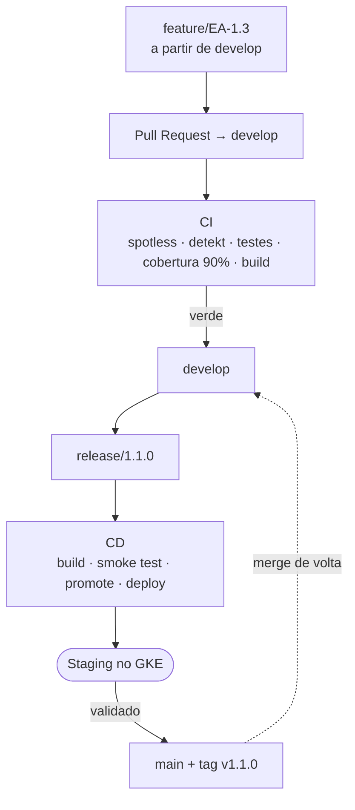

# Documentação — Tech-Challenge

Sistema de oficina mecânica. Kotlin + Spring Boot 3.4, PostgreSQL 16, Keycloak 26,
empacotado em container e entregue num cluster GKE.

## Entrega desta fase

| Documento | Responde |
|---|---|
| [solucao-e-arquitetura.md](solucao-e-arquitetura.md) | Descrição da solução e objetivos da fase, desenho da arquitetura (componentes, infraestrutura provisionada e fluxo de deploy) e as instruções de execução local, deploy em Kubernetes e provisionamento com Terraform |
| [arquitetura.svg](arquitetura.svg) | Desenho da arquitetura da solução — também em [PNG](arquitetura.png) e na fonte [Mermaid](arquitetura.mmd) |
| [arquitetura-codigo.svg](arquitetura-codigo.svg) | Desenho da arquitetura de código e dos padrões aplicados — também em [PNG](arquitetura-codigo.png) e na fonte [Mermaid](arquitetura-codigo.mmd) |

## Processo de entrega

| Documento | Responde |
|---|---|
| [versionamento.md](versionamento.md) | Como as branches se organizam (GitFlow), como nomear commits e branches, quando incrementar a versão e como a imagem é identificada |
| [ci.md](ci.md) | O que roda a cada Pull Request, o que reprova e como reproduzir na sua máquina |
| [cd.md](cd.md) | Como um push em `release/*` vira aplicação no ar em staging, e como voltar atrás |
| [escalabilidade.md](escalabilidade.md) | Como provocar o autoscaling e comprovar que o HPA criou réplicas |

## Domínio e arquitetura

| Documento | Conteúdo |
|---|---|
| [adr-001.md](adr-001.md) | Decisão arquitetural: PostgreSQL + Flyway sob Onion Architecture |
| [linguagem-ubiqua.md](linguagem-ubiqua.md) | Glossário do domínio: os termos usados no código e na conversa |
| [eventstorming.drawio](eventstorming.drawio) | Event storming do fluxo de ordem de serviço |
| [relatorio-vulnerabilidades.md](relatorio-vulnerabilidades.md) | Levantamento manual de vulnerabilidades das dependências |
| [TechChallengeAPI .postman_collection.json](TechChallengeAPI%20.postman_collection.json) | Coleção Postman com os endpoints da API |
| [TechChallengeAPI-Completa-Escalabilidade.postman_collection.json](TechChallengeAPI-Completa-Escalabilidade.postman_collection.json) | Coleção Postman completa (todas as APIs) + pasta de carga do cenário de escalabilidade |

## Fora desta pasta

| Onde | Conteúdo |
|---|---|
| [`../README.md`](../README.md) | Como rodar o projeto localmente, usuários do Keycloak, Swagger |
| [`../k8s/README.md`](../k8s/README.md) | Manifests do Kubernetes e a ordem de aplicação |
| [`../kind/README.md`](../kind/README.md) | Cluster local com kind, usando os mesmos manifests do GKE |
| [`../terraform/README.md`](../terraform/README.md) | Provisionamento do cluster GKE e dos secrets |

---

## O caminho de uma mudança

| Etapa | Gatilho | Detalhes |
|---|---|---|
| Desenvolvimento | branch a partir de `develop` | [versionamento.md](versionamento.md) |
| Verificação | PR para `main` ou `develop` | [ci.md](ci.md) |
| Entrega em staging | push em `release/*` | [cd.md](cd.md) |
| Liberação | merge em `main` + tag `vX.Y.Z` | [versionamento.md](versionamento.md#5-versionamento-semântico) |

Não existe pipeline de produção: `main` hoje é o registro do que foi liberado, não um
ambiente. As lacunas conhecidas de cada etapa estão na última seção de cada documento.
