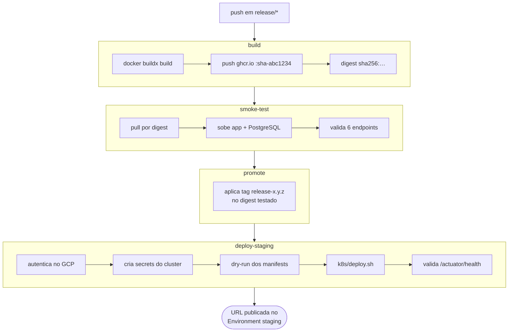

# Entrega Contínua (CD)

Como um commit numa branch de release vira uma aplicação no ar em staging.

- Workflow: [`.github/workflows/cd-staging.yml`](../.github/workflows/cd-staging.yml)
- Registry: GitHub Container Registry (`ghcr.io/iuriian/tech-challenge`)
- Destino: cluster **GKE**, namespace `tech-challenge-staging`
- Infraestrutura: [`terraform/`](../terraform/) · Manifests: [`k8s/`](../k8s/)

---

## 1. Quando roda

```yaml
on:
  push:
    branches: ["release/**"]
  workflow_dispatch:

concurrency:
  group: cd-staging
  cancel-in-progress: false
```

Todo push numa branch `release/*` faz o deploy em staging. Também dá para disparar
manualmente pela aba Actions.

O `concurrency` com `cancel-in-progress: false` enfileira execuções em vez de
cancelá-las: um deploy no meio de um `kubectl apply` cancelado deixaria o cluster
num estado indefinido.

---

## 2. Visão geral



O encadeamento importa: a tag legível (`release-1.0.0`) só é aplicada **depois** que
o smoke test passou. Uma imagem que não sobe nunca recebe um nome bonito.

---

## 3. Job `build`

1. `docker/setup-buildx-action` e login no GHCR com o `GITHUB_TOKEN`.
2. **Normaliza o nome da imagem** para minúsculas — o GHCR não aceita maiúsculas, e
   `github.repository` preserva o caso do dono do repositório.
3. `docker/metadata-action` com `tags: type=sha,format=short` → `:sha-816c3ff`.
4. `docker/build-push-action` com cache do próprio Actions
   (`cache-from/to: type=gha, mode=max`), o que reaproveita as camadas do Gradle
   entre execuções.
5. Exporta o **digest**: `ghcr.io/iuriian/tech-challenge@sha256:…`

A partir daqui todos os jobs falam por digest, não por tag. Digest é imutável: o que
o smoke test aprovou é exatamente o que o Kubernetes vai baixar.

O build usa o [`Dockerfile`](../Dockerfile) multi-stage: JDK 21 compila o boot jar
(`bootJar -x test`) e extrai as camadas do Spring Boot; a imagem final tem só o JRE
21 e roda com usuário não-root `spring`. Os testes **não** rodam aqui — quem testa é
a CI, no PR.

---

## 4. Job `smoke-test`

Usa [`.github/actions/smoke-test`](../.github/actions/smoke-test/action.yml): baixa a
imagem pelo digest, sobe um PostgreSQL 16 descartável numa rede Docker própria, sobe
o container da aplicação apontando para ele e espera o `/actuator/health` responder
(até 180s). No boot, o Flyway aplica as 12 migrations em `db/migration` — ou seja, o
smoke test também valida as migrations.

Endpoints verificados:

```
/actuator/health
/actuator/health/liveness
/actuator/health/readiness
/actuator/info
/v3/api-docs
/swagger-ui/index.html
```

Se algum falhar, o job imprime `docker logs` do container e reprova. A prontidão é
checada de fora (`curl` do runner) e não por `HEALTHCHECK` do Docker, porque a imagem
runtime não tem `curl` instalado.

---

## 5. Job `promote`

Aplica as tags legíveis ao digest já testado, sem reconstruir nada:

```bash
docker buildx imagetools create --tag <tag> <digest>
```

Tags configuradas:

| Regra | Resultado num push em `release/1.0.0` |
|---|---|
| `type=ref,event=branch` | `:release-1.0.0` |
| `type=raw,value=latest,enable={{is_default_branch}}` | *não aplicada* — a branch não é a default |

> A tag `latest` nunca é produzida por este workflow, já que ele só roda em
> `release/**` e a branch default é `main`. Se `latest` for desejada para staging,
> troque o `enable` por uma condição explícita.

---

## 6. Job `deploy-staging`

Roda no Environment `staging` do GitHub, e é ele quem publica a URL final na
interface do Actions.

| Passo | O que faz |
|---|---|
| Check environment configuration | Falha cedo, com mensagem clara, se faltar secret ou variable |
| Setup Google Cloud | `google-github-actions/auth` com `GCP_SA_KEY` |
| Configure kubectl | `gcloud container clusters get-credentials` + `gke-gcloud-auth-plugin` |
| Ensure namespace | Cria `tech-challenge-staging` se não existir |
| Create cluster secrets | Lê as senhas do **Google Secret Manager** e cria `db-credentials` e `keycloak-credentials` |
| Create GHCR pull secret | Cria `ghcr-creds` para o cluster puxar a imagem privada |
| Validate manifests | `kubectl apply --dry-run=server` — valida contra o cluster real, sem aplicar |
| Deploy | `./k8s/deploy.sh <digest> staging <namespace>` |
| Verify and expose URL | Espera o IP externo do Service, testa `/actuator/health` e escreve o resumo |
| Debug (`if: failure()`) | Imprime pods, services, PVCs, eventos e logs de todos os containers |

**Sobre as senhas.** Elas não estão em nenhum lugar do repositório nem nos secrets do
GitHub: o Terraform gera senhas aleatórias e as grava no Secret Manager; o pipeline
as lê em runtime e chama `::add-mask::` antes de usá-las, porque valores lidos em
tempo de execução não são mascarados automaticamente pelo GitHub.

### O que o `k8s/deploy.sh` faz

A ordem existe por um motivo, e é o que o script encapsula:

1. **Secrets** — cria os de desenvolvimento só se ainda não existirem (no pipeline já
   vieram do Secret Manager).
2. **ConfigMaps** — `postgres-initdb` e `keycloak-realm` são gerados a partir de
   `conf/init-db/` e `conf/realm-export.json`, os mesmos arquivos do
   `docker-compose.yml`. Nada de realm duplicado.
3. **PostgreSQL** — PVC antes do Deployment, senão o pod fica `Pending`.
4. **Service do Keycloak** e espera pelo IP externo (até 300s).
5. **Deployment do Keycloak** com `KC_HOSTNAME` = IP público. O `issuer` do token
   precisa ser idêntico à URL por onde o usuário autenticou — é por isso que o
   endereço precisa ser conhecido antes.
6. **Aplicação**, com o digest da imagem e `KEYCLOAK_URL` público, mas
   `KEYCLOAK_JWK_SET_URI` interno (`http://keycloak:8080`), para buscar as chaves sem
   sair do cluster.
7. **HPA** por último — aplicado antes, o alvo não existiria.

O Deployment da aplicação usa `maxSurge: 0`: o pod antigo cai antes do novo subir.
Num único nó `e2-medium` não há CPU para dois pods simultâneos. O custo é uma breve
indisponibilidade a cada deploy, aceitável em staging.

---

## 7. Infraestrutura

A fronteira entre Terraform e Kubernetes é deliberada: **Terraform cuida do que dura,
o pipeline cuida do que muda a cada commit.**

| Terraform (`terraform/`) | Pipeline + `k8s/` |
|---|---|
| APIs do GCP, cluster GKE, node pool com autoscaling | Deployments, Services, ConfigMaps |
| Service account do CI e papéis IAM | Secrets do cluster (lidos do Secret Manager) |
| Secrets do Secret Manager e senhas aleatórias | Namespace e ordem de aplicação (`deploy.sh`) |

Provisionamento inicial (uma vez, na mão):

```bash
cd terraform
cp terraform.tfvars.example terraform.tfvars   # ajuste project_id
terraform init && terraform apply              # 5 a 10 min
terraform output github_environment_variables  # valores para o Environment do GitHub
```

O `terraform output` entrega exatamente os valores que precisam ser cadastrados no
GitHub. Detalhes em [`terraform/README.md`](../terraform/README.md).

---

## 8. Configuração necessária no GitHub

Settings → Environments → **staging**

| Tipo | Nome | Obrigatório | Descrição |
|---|---|---|---|
| Secret | `GCP_SA_KEY` | sim | JSON da service account do CI |
| Secret | `GHCR_PAT` | recomendado | PAT com `read:packages`. Sem ele o `GITHUB_TOKEN` é usado e **expira ao fim do job** — pods que reiniciarem depois falham com `ImagePullBackOff` |
| Variable | `GCP_PROJECT_ID` | sim | Projeto no GCP |
| Variable | `GKE_CLUSTER` | sim | Nome do cluster (também prefixa os secrets no Secret Manager) |
| Variable | `GKE_ZONE` | sim | Zona do cluster |
| Variable | `KUBE_NAMESPACE` | não | Padrão: `tech-challenge-staging` |

---

## 9. Ambientes

| Ambiente | Como sobe | Onde | Banco |
|---|---|---|---|
| Local (dev) | `docker-compose up -d db keycloak` + `./gradlew bootRun` | máquina | container descartável |
| Local (stack) | `docker-compose --profile full up -d` | máquina | container + volume |
| Local (k8s) | `./kind/deploy-local.sh` | cluster kind, **mesmos manifests do GKE** | PVC do kind |
| Staging | push em `release/*` | GKE | PVC de 10Gi |
| Produção | — | — | **não existe ainda** |

O ambiente `kind` é o ensaio: valida os manifests de `k8s/` sem gastar recurso na
nuvem. Veja [`kind/README.md`](../kind/README.md).

---

## 10. Rollback

Não há rollback automático. Se o deploy subir algo quebrado:

```bash
# 1. mais rápido: volta o Deployment para a revisão anterior
kubectl rollout undo deployment/app -n tech-challenge-staging
kubectl rollout status deployment/app -n tech-challenge-staging

# 2. voltar para um digest específico já testado
kubectl set image deployment/app app=ghcr.io/iuriian/tech-challenge@sha256:<digest> \
  -n tech-challenge-staging

# 3. ver o histórico de revisões
kubectl rollout history deployment/app -n tech-challenge-staging
```

Os digests de cada execução ficam no log do job `build` e na aba Packages do
repositório.

Atenção: rollback da aplicação **não desfaz migrations**. O Flyway só avança. Se a
release aplicou uma migration destrutiva, voltar a imagem não resolve — por isso
migrations devem ser sempre compatíveis com a versão anterior da aplicação.

---

## 11. Quando o deploy falha

| Sintoma | Causa provável | O que fazer |
|---|---|---|
| `Configuracao ausente no Environment 'staging'` | Falta secret ou variable | Conferir a tabela da seção 8 |
| `ImagePullBackOff` | `ghcr-creds` com token expirado | Configurar `GHCR_PAT` e rodar o deploy de novo |
| `O Service app nao recebeu IP externo` | Cota de LoadBalancer ou zona sem capacidade | `kubectl get svc -n <ns>` e checar cota do projeto |
| Pod `Pending` | Nó sem CPU disponível | Aumentar `max_node_count` no Terraform ou reduzir `requests` |
| `issuer` inválido ao autenticar | Keycloak não recebeu IP a tempo e ficou com issuer interno | Ver o aviso no log do `deploy.sh` e refazer o deploy |
| App sobe e cai em loop | Falha de migration ou de conexão com o banco | O passo Debug já imprime `logs -c app --previous` |

O passo **Debug** só roda em falha e imprime pods, services, PVCs, eventos do
namespace, logs do init container `wait-for-db` e do container da aplicação
(inclusive a execução anterior). Comece por ele.

---

## 12. Limitações e próximos passos

- **Não existe pipeline de produção.** `main` não dispara deploy nenhum. Um
  `cd-production.yml` acionado por tag `v*` seria o passo natural.
- **Sem aprovação manual.** O Environment `staging` não tem *required reviewers*;
  qualquer push em `release/*` sobe direto.
- **A imagem é construída sem rodar testes.** O `Dockerfile` usa `bootJar -x test` e o
  CD não executa a suíte. Um push direto em `release/*` (sem passar por PR) chega em
  staging sem nenhum gate de qualidade.
- **Sem varredura da imagem.** Não há Trivy/Grype no pipeline.
- **HPA sem teste de carga.** O autoscaler está configurado (1 a 3 réplicas, 70% de
  CPU), mas nada no pipeline exercita o escalonamento.
