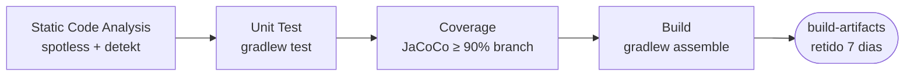

# Integração Contínua (CI)

O que roda a cada Pull Request, em que ordem, o que reprova e como reproduzir tudo
na sua máquina antes de abrir o PR.

- Workflow: [`.github/workflows/ci.yml`](../.github/workflows/ci.yml)
- Actions internas: [`.github/actions/`](../.github/actions/)
- Runner: `ubuntu-latest` · JDK 21 (Temurin) · Gradle Wrapper

---

## 1. Quando roda

```yaml
on:
  pull_request:
    branches: [main, develop]
```

Só em Pull Request com destino `main` ou `develop`. Consequências práticas:

- Push direto em `develop` **não** roda CI. É o argumento para proteger a branch.
- PR de `feature/*` para `feature/*` não roda CI.
- PR com destino `release/*` **não** roda CI — o que roda ali é o CD
  (veja [cd.md](cd.md)).

---

## 2. Os quatro jobs

Rodam em cadeia (`needs`): cada um só começa se o anterior terminou verde. Falhou o
primeiro, os outros nem são agendados.



### 2.1 Static Code Analysis

Formatação e análise estática, cada uma numa action própria que também comenta no PR.

| Passo | Action | Task Gradle | Comentário no PR |
|---|---|---|---|
| Spotless | `.github/actions/spotless` | `spotlessCheck` | lista arquivos e linhas fora do padrão |
| Detekt | `.github/actions/detekt` | `detekt` | lista as regras violadas com arquivo e linha |

As duas rodam com `fail-on-violation: 'false'` — não abortam na hora. Quem reprova é
o passo **Quality Gate** no fim do job, que lê os outputs das duas e sai com `exit 1`
se qualquer uma falhou. O motivo de ser assim: se o Spotless abortasse o job, o
Detekt nunca rodaria e você descobriria os problemas em duas rodadas em vez de uma.

Configuração: `spotless { ktlint("1.5.0") }` e `detekt { config = conf/detekt/detekt.yml }`
em `build.gradle.kts`. O Detekt reprova a partir de severidade **Warning**.

### 2.2 Unit Test

`./gradlew test --continue`, seguido do relatório gerado por
[`.github/scripts/unit-test-report.py`](../.github/scripts/unit-test-report.py), que
lê os XMLs JUnit em `build/test-results/` e publica um comentário único no PR
(atualizado a cada push, não duplicado).

O job reprova se houver **qualquer teste falhando** — o critério é literalmente
`failed == 0`. Testes *ignorados* (`skipped`) **não reprovam e não geram alerta**:
aparecem só como um número na tabela do comentário. Vale olhar esse número a cada PR,
porque um teste ignorado é cobertura que você acha que tem e não tem.

### 2.3 Coverage

`./gradlew jacocoTestReport` e depois
[`.github/scripts/coverage-report.py`](../.github/scripts/coverage-report.py).

| Parâmetro | Valor |
|---|---|
| Métrica avaliada | `BRANCH` |
| Mínimo | `90%` |
| Relatório lido | `build/reports/jacoco/**/*.xml` |

Excluídos da contagem (`build.gradle.kts`): `OfficinaApplication`, `**/config/**`,
`**/dto/**` — classes sem lógica própria, cujo teste mediria o framework, não o código.

> Existe também a regra equivalente dentro do Gradle
> (`jacocoTestCoverageVerification`, 90% de instrução, branch e linha), mas ela está
> **comentada** e não é ligada ao `check`. Hoje o gate de cobertura só existe no CI.

### 2.4 Build

`./gradlew build` — que no Gradle inclui a task `check`: além de empacotar o boot jar,
**roda de novo** os testes, o Detekt e o Spotless. É a terceira execução completa da
suíte dentro do mesmo PR. Trocar por `./gradlew assemble` empacota sem repetir o que
já passou nos jobs anteriores.

O jar vai para o artefato `build-artifacts` (`build/libs/`), retido por 7 dias. É um
artefato de conferência: a imagem que sobe em staging é construída pelo CD, a partir
do `Dockerfile`, e não deste jar.

---

## 3. Setup compartilhado

Todos os jobs começam por [`.github/actions/setup-kotlin`](../.github/actions/setup-kotlin/action.yml):

1. `actions/setup-java@v4` — Temurin 21;
2. cache de `~/.gradle`, com chave `gradle-<os>-<hash dos *.gradle*>`. Não há
   `restore-keys`: qualquer alteração num arquivo `.gradle*` invalida o cache inteiro
   e o job volta a baixar todas as dependências do zero;
3. `chmod +x gradlew`.

---

## 4. Permissões

```yaml
permissions:
  contents: read
  pull-requests: write
```

`pull-requests: write` é o que permite os comentários automáticos. Se faltar, as
actions não quebram: capturam o 403, emitem um warning e gravam o relatório no
*summary* do job.

---

## 5. Reproduzindo localmente

Rode isto antes de abrir o PR e você não descobre nada novo na CI:

```bash
./gradlew spotlessApply          # corrige a formatação
./gradlew spotlessCheck detekt   # o que o job 1 faz
./gradlew test                   # o que o job 2 faz
./gradlew jacocoTestReport       # o que o job 3 faz
./gradlew assemble               # o que o job 4 faz
```

Ou tudo de uma vez: `./gradlew build`.

**Relatórios gerados**

| Relatório | Caminho |
|---|---|
| Testes | `build/reports/tests/test/index.html` |
| Cobertura | `build/reports/jacoco/test/html/index.html` |
| Detekt | `build/reports/detekt/detekt.html` |

**Testes de integração.** As suítes em `src/test/kotlin/.../integration/` sobem um
PostgreSQL real via Testcontainers e **exigem Docker rodando**. Sem Docker elas não
executam:

```bash
./gradlew clean test --tests "*IntegrationTest" -i
```

---

## 6. Quando a CI reprova

| Job | Mensagem | O que fazer |
|---|---|---|
| Static Code Analysis | `Há problemas de formatação` | `./gradlew spotlessApply && git commit -am "style: aplica formatação"` |
| Static Code Analysis | `Foram encontrados problemas na análise estática` | Ler o comentário do PR: ele traz regra, arquivo e linha. Corrigir o código — não o `detekt.yml`. |
| Unit Test | `N teste(s) falhando` | O comentário linka o arquivo e a linha da falha. Reproduzir com `./gradlew test`. |
| Unit Test | coluna `⏭️ Ignorado` maior que zero | Não reprova o job, mas investigar: teste ignorado é cobertura que você acha que tem e não tem. |
| Coverage | `Cobertura de X% está abaixo do mínimo` | Abrir o HTML do JaCoCo, achar as classes vermelhas e escrever teste. |
| Build | falha de compilação | Se os testes passaram e o build não, quase sempre é código em `src/main` que só o `assemble` compila. |

---

## 7. Limitações conhecidas

- **Sem verificação em push.** Só PR aciona a CI. Um push direto em `develop` entra
  sem nenhum gate. Resolve-se com proteção de branch.
- **Teste ignorado não reprova.** Hoje o critério é `failed == 0`. Depois que a suíte
  de integração estiver rodando de forma confiável, vale endurecer para
  `failed == 0 and skipped == 0` em `unit-test-report.py`.
- **A suíte roda três vezes por PR.** `Unit Test` executa `test`; `Coverage` executa
  `jacocoTestReport`, que depende de `test`; e `Build` executa `build`, que inclui
  `check`. Fundir `Unit Test` com `Coverage` e trocar o `build` por `assemble` deixa
  uma execução só.
- **Sem verificação de dependências.** Não há checagem de CVE nas dependências
  (`dependency-check`, Dependabot ou Trivy na imagem). O
  [relatório de vulnerabilidades](relatorio-vulnerabilidades.md) é manual.
