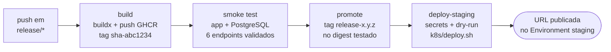

# Solução, Arquitetura e Execução

Documento de entrega do Tech Challenge — FIAP PosTech, Software Architecture, Grupo 89.
Cobre a descrição da solução, os objetivos da fase, o desenho da arquitetura e as
instruções de execução local, deploy em Kubernetes e provisionamento com Terraform.

| | |
|---|---|
| Repositório | <https://github.com/iuriian/tech-challenge> |
| Collection das APIs | [Postman](TechChallengeAPI%20.postman_collection.json) · Swagger UI em `/swagger-ui/index.html` |
| Vídeo demonstrativo | *(preencher com o link do YouTube/Vimeo, até 15 min)* |
| Ambiente de staging | *(preencher com a URL publicada pelo pipeline)* |

---

## 1. Descrição da solução

O sistema atende uma **oficina mecânica** e cobre o ciclo completo do atendimento:
do cadastro do cliente e do veículo até a entrega do serviço executado.

O núcleo do domínio é a **Ordem de Serviço**. Ela nasce quando o veículo é recebido,
passa por diagnóstico, recebe um **orçamento** montado a partir do catálogo de
serviços e das peças em estoque, aguarda a aprovação do cliente e só então entra em
execução. Cada transição é validada por uma máquina de estados no próprio domínio —
não é possível pular etapas nem alterar uma ordem já entregue.

```
RECEBIDA → EM_DIAGNOSTICO → AGUARDANDO_APROVACAO → EM_EXECUCAO → FINALIZADA → ENTREGUE
                                     ↓
                                CANCELADA
```

Além do fluxo da ordem, o sistema mantém:

| Recurso | O que resolve |
|---|---|
| **Clientes** | Cadastro com CPF/CNPJ validado, endereço e contatos |
| **Veículos** | Frota vinculada ao cliente, busca por placa e por motorista |
| **Funcionários** | Equipe da oficina com cargo (mecânico, atendente, admin) |
| **Peças** | Catálogo com controle de estoque: retirada e reposição com validação de saldo |
| **Catálogo de serviços** | Serviços oferecidos, com preço, tempo estimado e ativação/desativação |
| **Ordens de serviço** | Ciclo completo, orçamento calculado e métrica de tempo médio de execução |

O acesso é controlado por **perfis** emitidos pelo Keycloak e verificados em cada
endpoint: `ADMIN`, `ATENDENTE`, `MECANICO` e `CLIENTE`. Um cliente não cria ordem de
serviço; um mecânico não cadastra peça no catálogo.

A aplicação é um **monolito modular** em Kotlin sobre Spring Boot, organizado em
**Onion Architecture**: o domínio não conhece Spring, JPA nem HTTP, o que permite
testá-lo isoladamente e trocar a infraestrutura sem tocar nas regras de negócio.

---

## 2. Objetivos desta fase

Nas fases anteriores a entrega era a aplicação e seu domínio. Nesta fase o objeto de
avaliação é **como essa aplicação chega ao ar e se mantém no ar**:

1. **Containerizar a aplicação** em uma imagem enxuta, reproduzível e publicada em um
   registry — imagem multi-stage, usuário sem privilégios, camadas do Spring Boot
   extraídas para aproveitamento de cache.
2. **Orquestrar em Kubernetes**, com o que um ambiente real exige: probes de
   inicialização e saúde, limites de recurso, armazenamento persistente,
   configuração e segredos fora da imagem, e escalonamento horizontal automático.
3. **Provisionar a infraestrutura como código** com Terraform, de modo que o cluster,
   os segredos e as permissões do CI possam ser recriados do zero por um comando.
4. **Automatizar a verificação (CI)**: formatação, análise estática, testes unitários
   e de integração e um piso de cobertura, executados a cada Pull Request.
5. **Automatizar a entrega (CD)**: build da imagem, teste de fumaça da imagem antes de
   qualquer deploy, promoção da tag apenas depois do teste, e deploy no cluster com
   verificação de saúde ao final.
6. **Manter o ambiente reproduzível localmente**, para que o mesmo conjunto de
   manifests que roda no GKE possa ser validado na máquina do desenvolvedor.

---

## 3. Desenho da arquitetura proposta

### 3.1 Visão geral

[](arquitetura.svg)

> Versão vetorial: [`arquitetura.svg`](arquitetura.svg) · fonte editável: [`arquitetura.mmd`](arquitetura.mmd)

As setas cheias são o caminho da requisição e da entrega; as tracejadas são relações
de suporte — pull da imagem, escala do HPA, leitura das senhas e validação do token.

### 3.2 Componentes da aplicação

**Componentes em execução**

| Componente | Imagem / tecnologia | Exposição | Função |
|---|---|---|---|
| **app** | imagem própria · JRE 21 · Spring Boot 3.4 | Service `LoadBalancer` 80 → 8080 | API REST do domínio. Aplica as migrations do Flyway no boot |
| **keycloak** | `quay.io/keycloak/keycloak:26.2.1` | Service `LoadBalancer` 8080 | Emissor dos tokens JWT, realm `Fiap` importado de `conf/realm-export.json` |
| **postgres** | `postgres:16-alpine` | Service `ClusterIP` 5432 | Bases `oficina` e `keycloak` |

**Organização interna do código**

[](arquitetura-codigo.svg)

| Camada | Pacote | Conteúdo | Padrões |
|---|---|---|---|
| Apresentação | `presentation` | 6 controllers, DTOs de borda, 5 handlers de exceção | Controller · DTO · Bean Validation · `@ControllerAdvice` · RBAC declarativo |
| Aplicação | `application` | 6 services, 22 DTOs, 9 mappers, commands e results | Application Service · Facade · Mapper · Command |
| Domínio | `domain` | 41 use cases, 8 entidades, 6 value objects, 7 interfaces de repositório | Use Case · Entity · Aggregate Root · Value Object · Static Factory · State Machine · Port/Repository |
| Infraestrutura | `infrastructure` | 7 adaptadores de repositório, 6 mappers, Spring Data JPA, 9 classes de configuração | Adapter · Inversão de Dependência · Anticorruption Layer · Composition Root |

A regra que sustenta o desenho: **toda dependência de código aponta para o domínio**.
O domínio declara a porta (`ClienteRepository`); a infraestrutura a implementa
(`ClienteRepositoryImpl`). Os use cases são instanciados nas classes
`*BeanConfiguration`, o que mantém o núcleo livre de anotações do Spring.

**Endpoints principais**

| Recurso | Base | Operações |
|---|---|---|
| Clientes | `/clientes` | criar, listar, buscar por id/nome/documento, alterar, remover |
| Veículos | `/veiculos` | criar, listar, buscar por id/placa/motorista, alterar, remover |
| Funcionários | `/funcionarios` | criar, listar, buscar por id/nome, alterar, remover |
| Peças | `/pecas` | criar, listar, buscar por código/nome, alterar, retirar e repor estoque, reativar, remover |
| Catálogo de serviços | `/catalogo/servicos` | criar, listar ativos, listar todos, buscar, alterar, desativar, reativar |
| Ordens de serviço | `/servicos` | criar, buscar, listar, listar por cliente, orçamento, avançar status, alterar status, tempo médio, remover |

### 3.3 Infraestrutura provisionada

A fronteira é deliberada: **o Terraform cuida do que dura; o pipeline, do que muda a
cada commit.**

**Provisionado por Terraform** (`terraform/`)

| Recurso | Valor |
|---|---|
| Cluster GKE | `tech-challenge-staging`, zonal em `us-central1-a`, release channel REGULAR, VPC-native |
| Node pool `primary` | `e2-medium`, disco `pd-balanced` de 30 GB, **spot VMs**, autoscaling de 1 a 3 nós, auto-repair e auto-upgrade |
| Secret Manager | `<cluster>-db-password` e `<cluster>-keycloak-admin-password`, com senhas aleatórias geradas no apply |
| Service Account | `github-actions-cd`, com papéis de `container.developer` e acesso de leitura aos secrets |
| APIs do GCP | container, compute, logging, monitoring, secretmanager |

**Aplicado pelo pipeline** (`k8s/`)

| Recurso | Detalhe |
|---|---|
| `Deployment app` | Sem `replicas` fixo — quem controla é o HPA. `RollingUpdate` com `maxSurge: 0`. initContainer `wait-for-db`. Probes de startup, readiness e liveness em `/actuator/health`. Requests 200m/512Mi, limits 1 CPU/1Gi |
| `HPA app` | 1 a 3 réplicas, alvo de 70% de CPU sobre o *request*, janela de estabilização de 5 min na redução |
| `Deployment keycloak` | Realm importado de ConfigMap, `KC_HOSTNAME` com o IP público do LoadBalancer |
| `Deployment postgres` | Estratégia `Recreate`, probes com `pg_isready` |
| `PVC postgres-data` | 10Gi, `ReadWriteOnce` |
| ConfigMaps | `app-config`, `postgres-initdb`, `keycloak-realm` — os dois últimos gerados a partir de `conf/`, os mesmos arquivos usados pelo docker-compose |
| Secrets | `db-credentials`, `keycloak-credentials` (do Secret Manager) e `ghcr-creds` (pull da imagem) |

### 3.4 Fluxo de deploy



O encadeamento é o ponto: a imagem é referenciada por **digest** desde o primeiro
passo, e a tag legível só é aplicada depois que o smoke test passou. O que foi testado
é exatamente o que sobe no cluster.

Dentro do `deploy-staging`, a ordem importa e está encapsulada no `k8s/deploy.sh`:

1. Secrets e ConfigMaps.
2. PVC antes do Deployment do PostgreSQL — na ordem inversa o pod fica `Pending`.
3. Service do Keycloak e **espera pelo IP externo** — o `issuer` do token precisa ser
   a URL pública, então o endereço tem de ser conhecido antes de subir o Keycloak.
4. Deployment do Keycloak com `KC_HOSTNAME` já apontando para esse IP.
5. Aplicação, com o digest da imagem e o issuer público.
6. HPA por último: aplicado antes, o alvo não existiria.

Detalhamento completo, incluindo rollback e diagnóstico de falhas: [`cd.md`](cd.md).

---

## 4. Instruções

### 4.1 Execução local

**Pré-requisitos**

| Ferramenta | Versão |
|---|---|
| Docker e Docker Compose | recente |
| JDK 21 | Temurin ou equivalente |
| Gradle | use o wrapper incluso (`./gradlew`) |

**Variáveis de ambiente**

```bash
cp .env.example .env     # ou ./create-env.sh
```

**Opção A — infraestrutura em container, aplicação na IDE** *(recomendado para desenvolver)*

```bash
docker compose up -d db keycloak
./gradlew bootRun                 # Windows: gradlew.bat bootRun
```

**Opção B — stack completa em containers**

```bash
docker compose --profile full up -d
docker compose logs -f app
docker compose down               # para encerrar
```

| Serviço | URL | Credenciais |
|---|---|---|
| Aplicação (perfil `full`) | <http://localhost:8090> | — |
| Aplicação (`bootRun`) | <http://localhost:8080> | — |
| Swagger UI | `<url-da-app>/swagger-ui/index.html` | via Keycloak |
| Keycloak | <http://localhost:8081> | `admin` / `admin` |
| PostgreSQL | `localhost:5432` | `user` / `password` |
| Nginx (perfil `full`) | <http://localhost> | — |

Para usar os domínios do Nginx, acrescente ao `hosts` do sistema (o conteúdo está em
`conf/hosts`):

```
127.0.0.1 sso.postech.com.br
127.0.0.1 api.postech.com.br
```

**Usuários pré-configurados no realm `Fiap`**

| Usuário | Senha | Perfil |
|---|---|---|
| `admin` | `admin` | ADMIN |
| `atendente` | `atendente` | ATENDENTE |
| `mecanico` | `mecanico` | MECANICO |
| `clientepadrao` | `clientepadrao` | CLIENTE |

**Autenticando no Swagger UI:** clique em **Authorize**, informe o client `oficina` e
faça login com um dos usuários acima. O token é reaproveitado nas chamadas seguintes.

**Opção C — Kubernetes local com kind** *(valida os mesmos manifests do GKE)*

```bash
./kind/deploy-local.sh                      # cria o cluster, builda a imagem e faz o deploy
SKIP_BUILD=true ./kind/deploy-local.sh      # redeploy reaproveitando a imagem
APP_HOST_PORT=19000 ./kind/deploy-local.sh  # se as portas padrão estiverem ocupadas
./kind/down.sh                              # destrói o cluster
```

Portas padrão: aplicação em `18080`, Keycloak em `18081`. Os scripts são bash — no
Windows, use Git Bash ou WSL. Detalhes em [`kind/README.md`](../kind/README.md).

**Rodando os testes**

```bash
./gradlew test                    # unitários e de integração (integração exige Docker)
./gradlew jacocoTestReport        # relatório em build/reports/jacoco/test/html/index.html
./gradlew spotlessApply detekt    # formatação e análise estática
```

### 4.2 Deploy em Kubernetes

**Pelo pipeline** *(caminho normal)*

```bash
git checkout -b release/1.1.0
git push -u origin release/1.1.0
```

O push dispara o workflow `CD - Staging`, que builda, testa, promove e faz o deploy.
A URL fica publicada no Environment `staging` do GitHub, e o resumo do job traz os
links da aplicação, do Swagger e do Keycloak.

**Manualmente**, com `kubectl` já autenticado no cluster:

```bash
# 1. credenciais do cluster
gcloud container clusters get-credentials tech-challenge-staging \
  --zone us-central1-a --project SEU_PROJECT_ID

# 2. namespace
kubectl create namespace tech-challenge-staging

# 3. segredos — no GKE, nunca use os padrões de desenvolvimento
kubectl create secret generic db-credentials \
  --from-literal=POSTGRES_USER=user \
  --from-literal=POSTGRES_PASSWORD='SENHA_FORTE' -n tech-challenge-staging

kubectl create secret generic keycloak-credentials \
  --from-literal=KEYCLOAK_ADMIN_USER=admin \
  --from-literal=KEYCLOAK_ADMIN_PASSWORD='SENHA_FORTE' -n tech-challenge-staging

kubectl create secret docker-registry ghcr-creds \
  --docker-server=ghcr.io --docker-username=SEU_USUARIO \
  --docker-password='SEU_PAT' -n tech-challenge-staging

# 4. deploy
./k8s/deploy.sh ghcr.io/iuriian/tech-challenge@sha256:DIGEST staging tech-challenge-staging
```

**Verificação**

```bash
kubectl get pods,svc,pvc,hpa -n tech-challenge-staging
kubectl logs -l app=app -n tech-challenge-staging -c app --tail=50
curl http://$(kubectl get svc app -n tech-challenge-staging \
  -o jsonpath='{.status.loadBalancer.ingress[0].ip}')/actuator/health
```

**Rollback**

```bash
kubectl rollout undo deployment/app -n tech-challenge-staging
kubectl rollout history deployment/app -n tech-challenge-staging
```

O rollback volta a aplicação, mas **não desfaz migrations** — o Flyway só avança.
Migrations precisam ser compatíveis com a versão anterior da aplicação.

Detalhes dos manifests e da ordem de aplicação: [`k8s/README.md`](../k8s/README.md).

### 4.3 Provisionamento da infraestrutura com Terraform

**Pré-requisitos:** conta no GCP com billing ativo, `gcloud` e `terraform` instalados.

```bash
gcloud auth application-default login

cd terraform
cp terraform.tfvars.example terraform.tfvars   # ajuste project_id
terraform init
terraform plan
terraform apply                                # 5 a 10 minutos
```

Ao final, o `apply` entrega o que precisa ser cadastrado no GitHub:

```bash
terraform output github_environment_variables
terraform output ci_service_account_email
eval "$(terraform output -raw get_credentials_command)"
kubectl get nodes
```

**Configuração no GitHub** — Settings → Environments → `staging`:

| Tipo | Nome | Obrigatório | Descrição |
|---|---|---|---|
| Secret | `GCP_SA_KEY` | sim | JSON da chave da service account do CI |
| Secret | `GHCR_PAT` | recomendado | PAT com `read:packages`. Sem ele o `GITHUB_TOKEN` expira ao fim do job e pods que reiniciarem falham com `ImagePullBackOff` |
| Variable | `GCP_PROJECT_ID` | sim | Projeto no GCP |
| Variable | `GKE_CLUSTER` | sim | Nome do cluster — também prefixa os secrets no Secret Manager |
| Variable | `GKE_ZONE` | sim | Zona do cluster |
| Variable | `KUBE_NAMESPACE` | não | Padrão: `tech-challenge-staging` |

A chave da service account **não** é criada pelo Terraform de propósito: o recurso
`google_service_account_key` gravaria a chave privada no state em texto puro. Gere-a
manualmente conforme o [`terraform/README.md`](../terraform/README.md).

**Parâmetros ajustáveis** (`terraform/variables.tf`): `machine_type`,
`min_node_count`, `max_node_count`, `disk_size_gb`, `use_spot_vms`, `zone`.

**Destruindo o ambiente**

```bash
terraform destroy
```

O cluster é criado com `deletion_protection = false` justamente para permitir isso em
staging. Em produção, mantenha a proteção ligada.

> **State remoto.** O state local funciona para uma pessoa, mas some ao trocar de
> máquina e não suporta dois `apply` simultâneos. Para usar um bucket GCS, veja a
> seção correspondente no [`terraform/README.md`](../terraform/README.md).
> Nunca versione o `.tfstate` — ele grava valores sensíveis em texto puro.

---

## 5. Collection das APIs

| Formato | Onde |
|---|---|
| **Postman** | [`TechChallengeAPI .postman_collection.json`](TechChallengeAPI%20.postman_collection.json) — importe no Postman |
| **Swagger UI** | `http://localhost:8080/swagger-ui/index.html` (local) ou `http://<IP-do-LoadBalancer>/swagger-ui/index.html` (staging) |
| **OpenAPI JSON** | `/v3/api-docs` |

A collection cobre todos os recursos descritos na seção 3.2. Para os endpoints
protegidos, obtenha o token no Keycloak com um dos usuários da tabela em 4.1.

---

## 6. Vídeo demonstrativo

*(preencher com o link do YouTube ou Vimeo — público ou não listado, até 15 minutos)*

Roteiro sugerido, cobrindo o que é avaliado nesta fase:

1. `terraform apply` e o cluster criado no console do GCP.
2. Abertura de um Pull Request e a CI reprovando/aprovando com os comentários no PR.
3. Push em `release/*` e o CD executando: build, smoke test, promoção e deploy.
4. Aplicação no ar em staging: Swagger autenticado via Keycloak e um fluxo completo de
   ordem de serviço, do cadastro à entrega.
5. `kubectl get pods,hpa` mostrando o escalonamento e os probes.

---

## 7. Documentação complementar

| Documento | Conteúdo |
|---|---|
| [versionamento.md](versionamento.md) | GitFlow, convenções de branch e commit, SemVer, versionamento da imagem |
| [ci.md](ci.md) | Detalhamento da pipeline de integração contínua |
| [cd.md](cd.md) | Detalhamento da pipeline de entrega, rollback e troubleshooting |
| [adr-001.md](adr-001.md) | Decisão arquitetural: PostgreSQL e Flyway sob Onion Architecture |
| [linguagem-ubiqua.md](linguagem-ubiqua.md) | Glossário do domínio |
| [relatorio-vulnerabilidades.md](relatorio-vulnerabilidades.md) | Levantamento de vulnerabilidades das dependências |
| [`../k8s/README.md`](../k8s/README.md) · [`../kind/README.md`](../kind/README.md) · [`../terraform/README.md`](../terraform/README.md) | Manifests, ambiente local em Kubernetes e infraestrutura |
