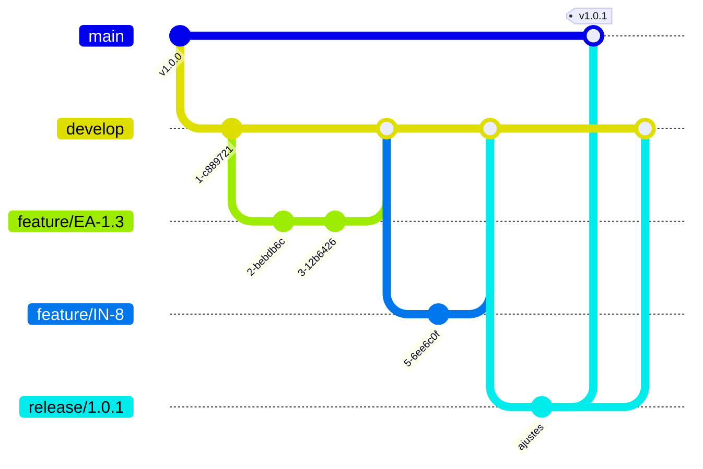

# Versionamento

Como o código do Tech-Challenge é organizado em branches, como as mudanças chegam
até `main` e como cada entrega ganha um número.

- Repositório: <https://github.com/iuriian/tech-challenge>
- Modelo de branches: **GitFlow**
- Versionamento: **SemVer** (`MAJOR.MINOR.PATCH`)
- Convenção de mensagens: **Conventional Commits**

---

## 1. Modelo de branches

O projeto segue o GitFlow: duas branches de vida longa (`main` e `develop`) e três
famílias de branches temporárias que nascem de uma e morrem em outra.

| Branch | Vida | Nasce de | Volta para | Papel |
|---|---|---|---|---|
| `main` | permanente | — | — | Reflete o que está (ou irá) em produção. Só recebe merge de `release/*` e `hotfix/*`. |
| `develop` | permanente | `main` | — | Linha de integração. É o estado acumulado da próxima entrega. |
| `feature/<id>-<slug>` | temporária | `develop` | `develop` | Uma funcionalidade ou refatoração. |
| `bugfix/<id>-<slug>` | temporária | `develop` | `develop` | Correção de algo que ainda não foi liberado. |
| `release/<x.y.z>` | temporária | `develop` | `main` **e** `develop` | Estabilização da entrega. É o gatilho do deploy em staging. |
| `hotfix/<x.y.z>` | temporária | `main` | `main` **e** `develop` | Correção urgente do que já está em produção. |



### Regra que não pode ser quebrada

`release/*` e `hotfix/*` sempre voltam para **as duas** branches permanentes. Se a
correção entrar só em `main`, o próximo release nascido de `develop` a desfaz — e o
bug reaparece já corrigido no changelog.

---

## 2. Nomenclatura

O prefixo da branch é o que a torna legível numa lista de trinta. Padrão do projeto:

```
<tipo>/<identificador-do-card>-<descricao-curta>

feature/EA-1.3-orcamento-ordem-servico
bugfix/IN-14-status-http-delete
release/1.1.0
hotfix/1.0.1
```

- Tudo em minúsculas, palavras separadas por hífen.
- O identificador é o card (EA-1.3, IN-8) — é o que liga o código à tarefa.
- Sem acentos e sem `_`.

> **Estado atual.** O repositório hoje tem 36 branches remotas com padrões
> misturados: `feat/EA-1.3` e `feature/EA-1.3` (as duas existem), `issues/9`,
> `IN-6`, `review`, `testes_veiculo`. Vale escolher `feature/` como prefixo único
> e apagar as branches remotas já mergeadas — cada branch morta é uma chance de
> alguém partir do lugar errado.

---

## 3. Commits

Conventional Commits, que já é a prática do histórico:

```
<tipo>: <descrição no imperativo, minúscula, sem ponto final>

feat: adiciona filtros ao repositorio de ordens de servico
fix: padroniza retorno dos deletes para 200
test: aumenta cobertura do servico
refactor: separa serviço de ordem de serviço e modela orçamento
style: aplica formatacao do spotless
chore: normaliza quebras de linha
docs: documenta o fluxo de CI/CD
```

Tipos em uso: `feat`, `fix`, `refactor`, `test`, `style`, `chore`, `docs`.

O tipo do commit não é decoração: é o que permite gerar changelog automaticamente e
o que indica se a entrega é `MINOR` (`feat`) ou `PATCH` (`fix`).

---

## 4. Pull Requests

Toda mudança entra por PR — a CI só roda em `pull_request` (veja [ci.md](ci.md)),
então um push direto em `develop` passa sem nenhuma verificação.

**Checklist antes de pedir review**

1. Branch atualizada com o destino (`git merge origin/develop`).
2. `./gradlew spotlessApply detekt test` verde localmente.
3. Descrição com o card, o que muda e como testar.
4. Sem arquivos de build, `.env` ou `terraform.tfstate` no diff.

**Destino do PR**

| Origem | Destino |
|---|---|
| `feature/*`, `bugfix/*` | `develop` |
| `release/*` | `main` (e merge de volta em `develop`) |
| `hotfix/*` | `main` (e merge de volta em `develop`) |

**Proteção recomendada** (Settings → Branches), hoje não configurada:
`main` e `develop` com PR obrigatório, 1 aprovação, checks `Static Code Analysis`,
`Unit Test`, `Coverage` e `Build` obrigatórios, e merge bloqueado se a branch
estiver desatualizada.

---

## 5. Versionamento semântico

`MAJOR.MINOR.PATCH`:

| Parte | Incrementa quando | Exemplo no projeto |
|---|---|---|
| MAJOR | mudança incompatível no contrato da API | remover `GET /clientes/{id}` ou trocar o formato da resposta |
| MINOR | funcionalidade nova, compatível | novo endpoint de métricas de tempo médio |
| PATCH | correção compatível | `fix: padroniza retorno dos deletes para 200` |

Enquanto o projeto estiver em `0.y.z`, a API é considerada instável e `MINOR` pode
quebrar contrato. A primeira entrega estável é a `1.0.0`.

### Onde a versão vive

| Lugar | Valor hoje | Quem atualiza |
|---|---|---|
| `build.gradle.kts` → `version` | `0.0.1` | manual, no início da branch `release/*` |
| Tag git | *nenhuma tag criada* | manual, no merge em `main` |
| Tag da imagem no GHCR | `sha-<commit>` + `release-<x.y.z>` | pipeline de CD |

> **Divergência a resolver.** Existe uma branch `release/1.0.0`, mas
> `build.gradle.kts` ainda diz `0.0.1` e o repositório não tem nenhuma tag git. Do
> jeito que está, não há como apontar para um commit e dizer "esta é a 1.0.0".

### Fluxo de uma entrega

```bash
# 1. abre a release a partir de develop
git checkout develop && git pull
git checkout -b release/1.1.0

# 2. fixa a versão
#    build.gradle.kts -> version = "1.1.0"
git commit -am "chore: prepara release 1.1.0"

# 3. push -> dispara o CD para staging (veja cd.md)
git push -u origin release/1.1.0

# 4. validado o staging, PR release/1.1.0 -> main, merge

# 5. tag anotada no commit de merge
git checkout main && git pull
git tag -a v1.1.0 -m "Release 1.1.0"
git push origin v1.1.0

# 6. devolve para develop
git checkout develop
git merge --no-ff main
git push
```

Correção urgente segue o mesmo caminho, partindo de `main` e incrementando o PATCH:
`hotfix/1.1.1`.

---

## 6. Versionamento da imagem Docker

O código tem uma versão; a imagem tem três formas de ser referenciada, e elas não
servem para a mesma coisa:

| Referência | Exemplo | Uso |
|---|---|---|
| Digest | `ghcr.io/iuriian/tech-challenge@sha256:9f2c…` | **É o que o deploy usa.** Imutável: aponta sempre para o mesmo conteúdo. |
| Tag de commit | `:sha-816c3ff` | Rastrear qual commit gerou a imagem. |
| Tag de branch | `:release-1.0.0` | Leitura humana; aplicada só depois do smoke test passar. |

O deploy no Kubernetes referencia a imagem **por digest**, nunca por tag móvel.
Uma tag pode ser reapontada; um digest, não — é o que garante que o que foi testado
é exatamente o que subiu.

---

## 7. Quebras de linha

O conteúdo versionado está em **LF**, mas o `.gitattributes` atual cobre só quatro
padrões:

```
/gradlew text eol=lf
*.sh     text eol=lf
*.bat    text eol=crlf
*.jar    binary
```

Como não há regra para o resto, um checkout no Windows produz arquivos em CRLF e o
git passa a considerar o repositório inteiro modificado. Medido neste working tree:
**331 arquivos e ~22.800 linhas de diferença sem que nada tenha mudado de fato**. O
efeito prático é PR ilegível e conflito em qualquer merge.

A correção é uma regra abrangente no topo do arquivo:

```
* text=auto eol=lf

*.bat text eol=crlf
*.cmd text eol=crlf
*.ps1 text eol=crlf
/gradlew text eol=lf
*.sh  text eol=lf
*.jar binary
```

Seguida de uma renormalização, em um commit isolado (senão ele se mistura com
mudanças reais e ninguém consegue revisar):

```bash
git add --renormalize .
git commit -m "chore: normaliza quebras de linha (LF) via gitattributes"
```

Quem já tinha o repositório clonado precisa refazer o checkout depois de puxar:

```bash
git rm --cached -r . && git reset --hard
```

---

## 8. O que não é versionado

Fora do git (veja `.gitignore`):

- `build/`, `.gradle/`, `.kotlin/`, `.idea/`
- `.env` — use `.env.example` como modelo e `create-env.sh` para gerar
- `terraform/terraform.tfvars` e `*.tfstate` — o state grava valores sensíveis em texto puro
- Qualquer credencial. As senhas de staging são geradas pelo Terraform e ficam no
  Google Secret Manager; o pipeline as lê em runtime.
